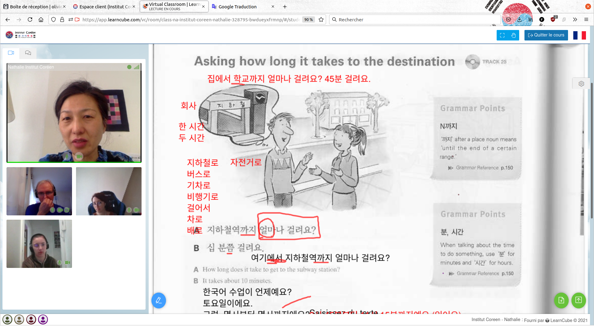
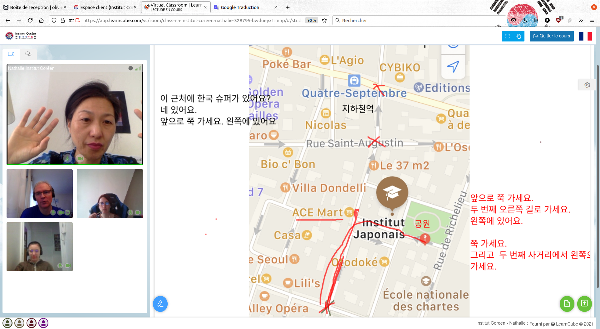
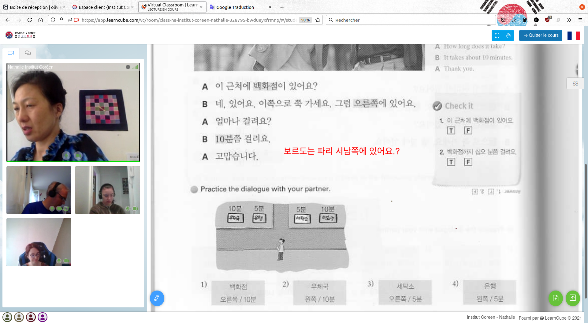
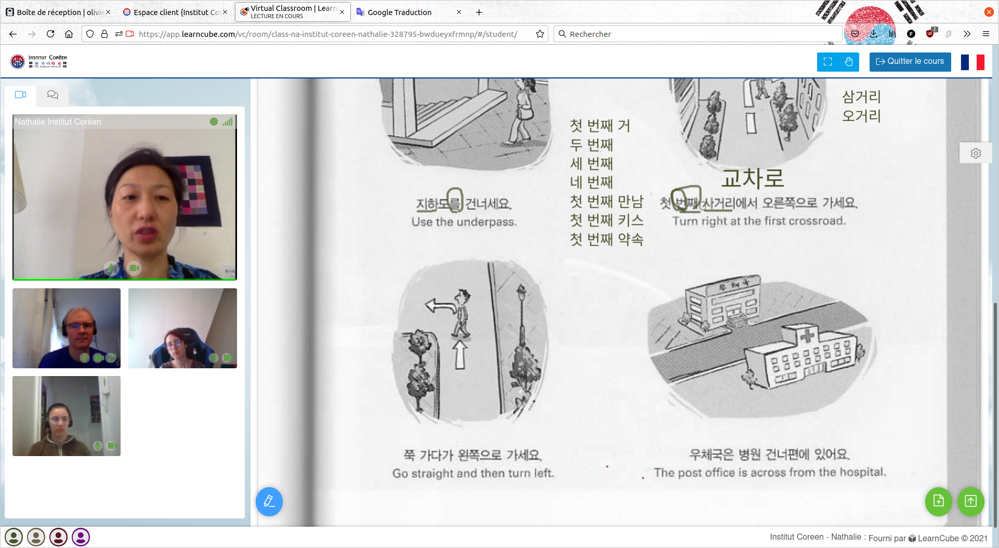

# 🇰🇷 Unit 8 - 위치와 방양 - Localisation Direction

## vocabulaire

* 사무실 : le bureau (lieu)
* 찰판 : Tableau

## Support de Cours

[8과_위치와_방향.pptx](8과_위치와_방향.pptx) 

## 22/05

| 위치와  | localisation   |
| ------ | -------------- |
| 위      | dessus / sur   |
| 아레 밑 | dessous / sous |
| 앞      | devant         |
| 뒤      | derriere       |
| 옆      | à coté         |
| 안      | dans           |
| 오른쪽  | droite         |
| 왼쪽    | gauche         |
| 가운데  | au milieu      |
| 집안    | dedans         |
| 집빡    | dehors         |

### diagonales 

### nord / est / sud / ouest

### loin / pret / de l'autre cote

## 29/05

### etages

### etages et sous sol

## 05/06

### etages 

### vers : 로

* à pieds 걸어서
* en voiture 차로
* en métro 지하절로
* en train 기차로
* en avion 비형기로
* en bus 버스로

demander son chemin dans la rue

