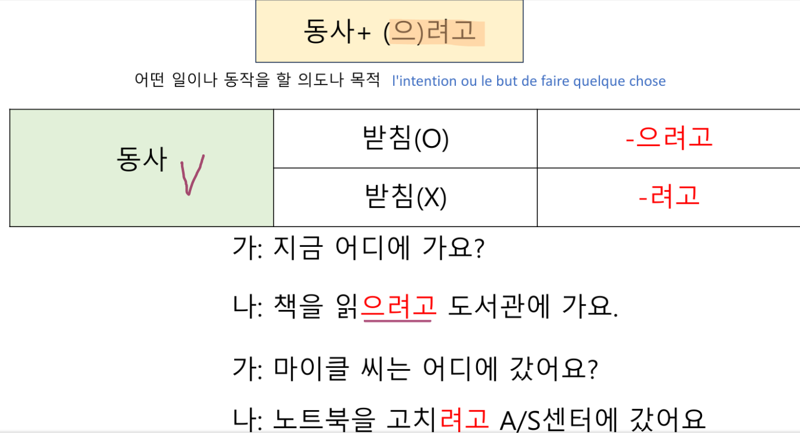
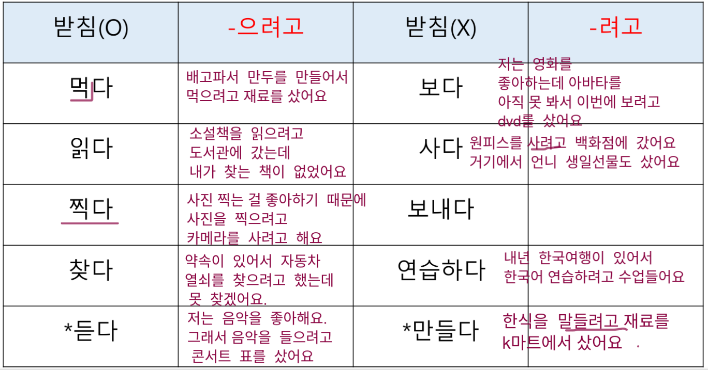

# AK 4 Unit 2 - 편리한 생활 - Convenient life
[TOC]
```toc
```
# Expressions - 표현

* Expressing intentions: 의도 표현하기
* Expressing simultaneous actions: 동시 동작 표현하기
* Suggesting solutions:  헤결 방안 제시하기
* Reminding others about what they already know:  상대방이 알고 있는 사실 상기시키기

# Vocabulary - 어휘

## vocabulary related to tools

| Coréen | Français           |
| ------ | ------------------ |
| 핸드폰       | portable           |
| 인터넷       | internet           |
| 토화       | appel téléphonique |
| 디자인       | design             |
| 가볍다       | léger              |
| 녹화하다       | enregistrer        |
| 자막       | sous-titre         |
| 화질       | qualité d'image    |
| 편리하다       | pratique               |
| 가격       | prix               |
| 품질       | qualité            |
| 정보       | information        |
| 채팅       | chat internet      |
| 사이트       | site web           |
| 라디오       | radio                   |

### Noms

| Coréen | Français             |
| ------ | -------------------- |
| 글자       | lettre               |
| 크기       | taille               |
| 수       | nombre               |
| 종이컵       | mug en papier/carton |
| 컵       | mug                  |
| 환경       | environnement        |
| 기름       | essence              |
| 휘발유 | essence , huile 
| 찬성       | accord               |
| 반대       | désaccord            |
| 뉴스       | news                 |
| 인터넷 카페       | cybercafé            |
| 나이       | age                  |
| 제뭄       | produit              |
| 소식 | les news |
## Verbes

| Coréen | Français             |
| ------ | -------------------- |
|  씻다      | laver                |
|  비교하다      | comparer             |
|  절약하다      | économiser             |
|  확인하다      | vérifier / certifier |
|  잊어버리다      | oublier              |
|  걸다      | faire un appel       |

## Autres

| Coréen | Français                 |
| ------ | ------------------------ |
| 직접   | en personne, directement |
| 전자       | ancien                          |

## Worlds that go together

| Coréen | Français |
| ------ | -------- |
| 전화를 걸다       | faire un appel         |

# Grammaire

## V-(으)려고 하다

ajouté pour indiquer que la personne à l'intention de faire qqchose

주말에 영화를 보==려고 해요== 

ce weekend je prévois d'aller voir un film





## V-(으)면서

pour indiquer que les 2 propositions arrivent en même temps

운전해요 + 음악을 들어요 = 운전하==면서== 음악을 들어요

je conduis + j'écoute la musique = en conduisant j'écoute la musique

## V-(으)면 되다

signifie "c'est ok / c'est assez / c'est pas un pb si c'est fait ainsi" 

utilisé pour suggérer une solution facile/simple

택시를 타==면 돼요== : c'est ok si tu prends le taxi

## A/V-잖아(요)

ajouté au verbe ou adjectif pour rappeler aux autres ce qu'ils savent déjà

이 시간에는 같이 복잡하==잖아요== : c'est compliqué en ce moment

## V-(으)려고

signifie "afin de" : utilisé pour indiquer qu'on a l'intention / prévoit une certaine action

방학에 여행을 가==려고== 비행기 표를 예약했어요

afin de partir en vacances, j'ai réservé un billet d'avion

## 만

seulement

- 아침애 먹었어요?
- 시간이 없어서 커피==만== 만셨어요

* qu'as tu dejeuné ?
* comme je n'avais pas le temps j'ai juste/seulement bu un café