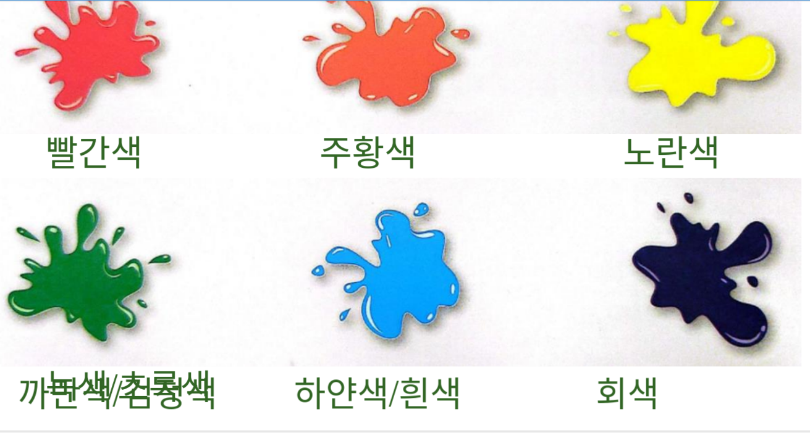
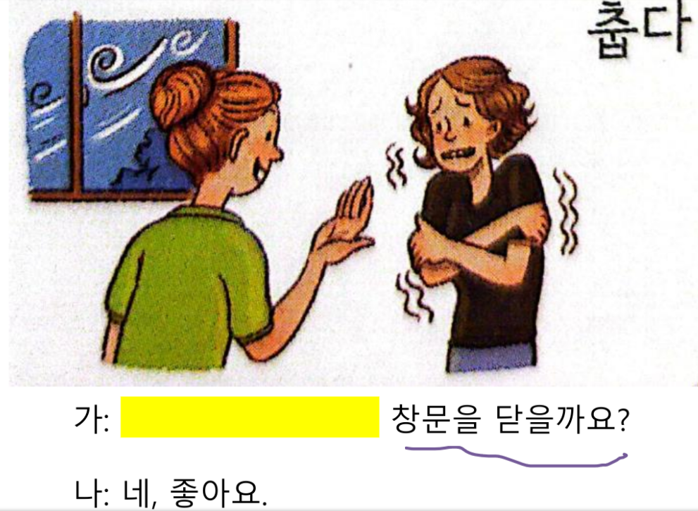
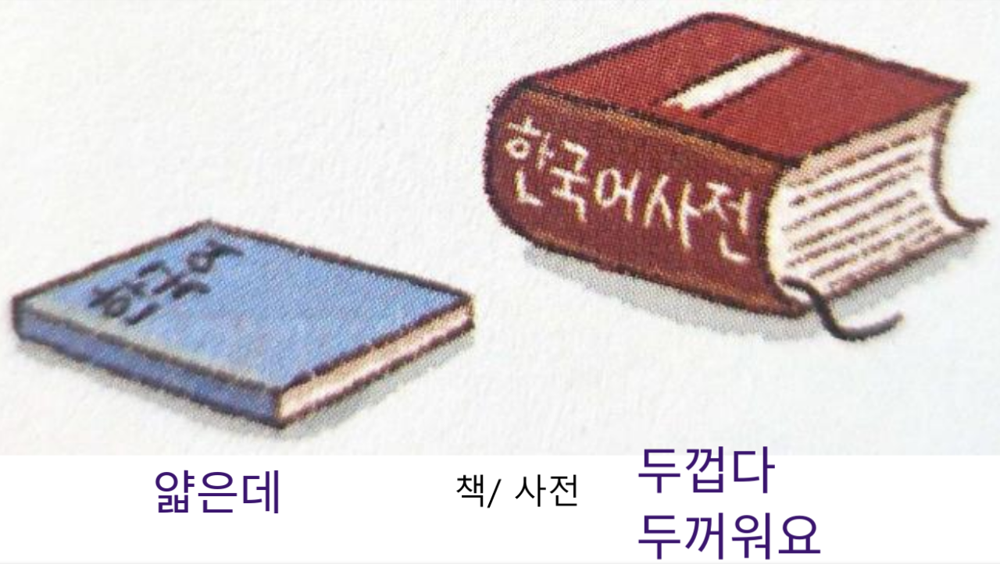

---
tags:
  - 고있다
  - 아니다
  - 보이다
  - 는데
  - couleurs
  - caractères
title: AK 4 Unit 1 - 외모와 성격 - Appearence and personality
---
```table-of-contents
```
## 2023-09-30

### couleurs



### Porter vetement


## 2023-10-07

### caractères

#### actif

#### presse

####  gentil

####  timide


## 2023-10-14
### 는데








### 그렇다


### ㅎ irrégulier


### ㅎ + 아서 = 얘서


### 네요 니까


### ㅎ + 고


### ㅎ + 은/ㄴ


### exo ㅎ + ....


## 2023-10-21 
### couleurs

### taille cheveux

### forme cheveux


### taille


### poids 


### beau - moche

### photo famille
