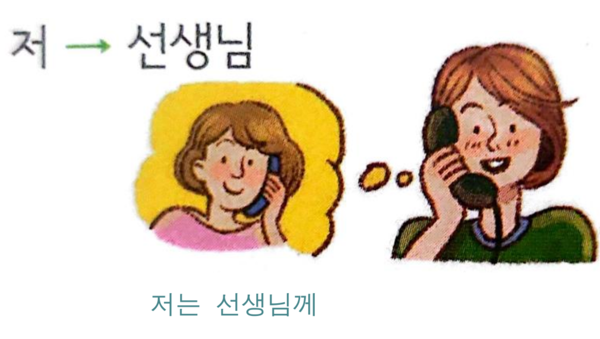

---
tags:
  - 사건
  - 사고
title: Unit 3 Incidents and Accidents 사건 사고
---
```table-of-contents
```
## 2024-01-13
### ~ 대 요

présent


passé


### EXO ~ 대 요


### ~ 대 요 (2)

Second cas : utiliser pour parler à quelqu'un d'une vérité générale

exemple : la vitamine A est bonne pour les yeux


### EXO ~ 한테 . 해게  . 게





## 2024-01-27
### V-고 나서


### V-아/어 있다


## 2024-02-03
### ~ 지 알다/모르다


[](2024-02-03-%20지%20알다%20모르다%2008.png)


## 2024-02-10
### compréhension écrite


### compréhension orale


## 2024-02-17
### compréhension écrite


